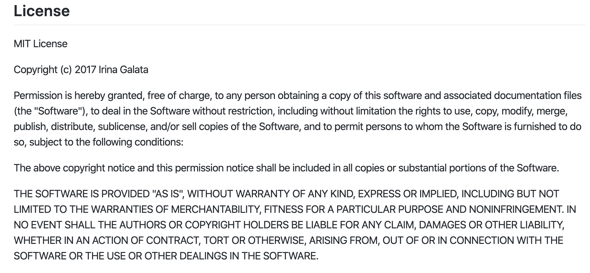

# group-project-2019-20-group-13-1
-Licensing

- API Documentation:

GET /destinations:

Displays all destinations

optional /id for specific country search

GET /Search/keywords:

Displays search results for keywords searched,

optional /keyword1/keyword2/keyword3 ; the user can search between 1 and 3 keywords

GET /Weather: 

search countries weather 

add /country1 for optional specific country weather search

GET /Summary:

search countries summary

add /country1 for optional specific country summary search

GET /Attractions: 
search countries attractions

add /country1 for optional specific country summary search

POST /rating:

add user reviews to the database.

add /rating/comments 

rating : number of stars

comments: user feedback

- System Architecture:

- How to access the server:

1. Edit database IP address user and password from dbconfig.js

2.Make sure const dbcconfig in dbconnect.js is on the right path.

3.Make sure Mysql1 in app.js is on the right path.

4.Make sure Nodejs is installed alongside Mysql and express 

--to install mysql and express run the following commands in the cmd (console commandline)

npm install Mysql
npm install express

5. Finally, run the following in the cmd
node app.js

group-project-2019-20-group-13-1 created by GitHub Classroom

